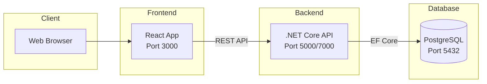

# Implementation Plan - Todo App Backend

## Summary

This document outlines the implementation plan for adding a .NET Core backend with PostgreSQL to the existing React Todo App.

## Current State

- **Frontend**: React app with local state management
- **Backend**: Empty `Backend/` directory
- **Database**: None (to be created)

## Target Architecture



## Data Model

### Todo Entity

| Property  | Type      | Description                      |
| --------- | --------- | -------------------------------- |
| Id        | int       | Primary key (auto-increment)     |
| Text      | string    | Todo description (max 500 chars) |
| Completed | bool      | Completion status                |
| CreatedAt | DateTime  | Creation timestamp               |
| UpdatedAt | DateTime? | Last update timestamp            |

## API Design

### Endpoints

```
GET    /api/todo           - List all todos
GET    /api/todo/{id}      - Get single todo
POST   /api/todo           - Create new todo
PUT    /api/todo/{id}      - Update todo
DELETE /api/todo/{id}      - Delete todo
PATCH  /api/todo/{id}/toggle - Toggle completion
```

### Request/Response Examples

**Create Todo**

```json
POST /api/todo
{
  "text": "Buy groceries"
}

Response: 201 Created
{
  "id": 1,
  "text": "Buy groceries",
  "completed": false,
  "createdAt": "2026-03-31T14:45:00Z",
  "updatedAt": null
}
```

**Toggle Todo**

```json
PATCH /api/todo/1/toggle

Response: 200 OK
{
  "id": 1,
  "text": "Buy groceries",
  "completed": true,
  "createdAt": "2026-03-31T14:45:00Z",
  "updatedAt": "2026-03-31T14:46:00Z"
}
```

## Implementation Steps

### Phase 1: Project Setup

1. Create .NET Core Web API project in `Backend/TodoApi`
2. Add NuGet packages:
   - Npgsql.EntityFrameworkCore.PostgreSQL
   - Microsoft.EntityFrameworkCore.Design
   - Microsoft.EntityFrameworkCore.Tools
3. Configure project structure

### Phase 2: Data Layer

1. Create `Todo` model in `Models/`
2. Create `AppDbContext` in `Data/`
3. Configure PostgreSQL connection string
4. Create initial migration
5. Update database

### Phase 3: Business Logic

1. Create DTOs in `DTOs/`
   - CreateTodoDto
   - UpdateTodoDto
   - TodoDto
2. Create repository interface and implementation
3. Create service interface and implementation

### Phase 4: API Layer

1. Create `TodoController` with all endpoints
2. Configure CORS for frontend
3. Add Swagger documentation
4. Configure Program.cs

### Phase 5: Frontend Integration

1. Create API service in frontend
2. Update App.js to use API calls
3. Add loading states
4. Add error handling

### Phase 6: Testing

1. Test API endpoints with Swagger
2. Test frontend-backend integration
3. Test error scenarios

## Technical Decisions

### Why .NET Core?

- High performance
- Strong typing with C#
- Excellent Entity Framework support
- Built-in dependency injection
- Cross-platform

### Why PostgreSQL?

- Open source and free
- Excellent performance
- Rich feature set
- Good .NET support via Npgsql

### Why Repository Pattern?

- Separation of concerns
- Testability
- Flexibility to change data source
- Clean architecture

### Why DTOs?

- Decouple API from domain model
- Control exposed data
- Validation support
- Versioning support

## Configuration

### appsettings.json

```json
{
  "ConnectionStrings": {
    "DefaultConnection": "Host=localhost;Database=todo_db;Username=postgres;Password=your_password"
  },
  "Logging": {
    "LogLevel": {
      "Default": "Information",
      "Microsoft.AspNetCore": "Warning"
    }
  },
  "AllowedHosts": "*"
}
```

### CORS Configuration

```csharp
builder.Services.AddCors(options =>
{
    options.AddPolicy("AllowFrontend", policy =>
    {
        policy.WithOrigins("http://localhost:3000")
              .AllowAnyHeader()
              .AllowAnyMethod();
    });
});
```

## Database Schema

```sql
CREATE TABLE "Todos" (
    "Id" SERIAL PRIMARY KEY,
    "Text" VARCHAR(500) NOT NULL,
    "Completed" BOOLEAN NOT NULL DEFAULT FALSE,
    "CreatedAt" TIMESTAMP NOT NULL DEFAULT CURRENT_TIMESTAMP,
    "UpdatedAt" TIMESTAMP NULL
);

CREATE INDEX IX_Todos_Completed ON "Todos"("Completed");
CREATE INDEX IX_Todos_CreatedAt ON "Todos"("CreatedAt");
```

## Frontend Changes Required

### New API Service

```javascript
// src/services/api.js
const API_BASE = "http://localhost:5000/api";

export const todoApi = {
  getAll: () => fetch(`${API_BASE}/todo`).then((r) => r.json()),
  create: (text) =>
    fetch(`${API_BASE}/todo`, {
      method: "POST",
      headers: { "Content-Type": "application/json" },
      body: JSON.stringify({ text }),
    }).then((r) => r.json()),
  toggle: (id) =>
    fetch(`${API_BASE}/todo/${id}/toggle`, {
      method: "PATCH",
    }).then((r) => r.json()),
  delete: (id) =>
    fetch(`${API_BASE}/todo/${id}`, {
      method: "DELETE",
    }),
};
```

### Updated App.js

- Replace local state with API calls
- Add loading states
- Add error handling
- Fetch todos on component mount

## Security Considerations

1. **CORS**: Only allow frontend origin
2. **Input Validation**: Validate all inputs
3. **SQL Injection**: Protected by EF Core
4. **HTTPS**: Enforce in production
5. **Authentication**: Can be added later if needed

## Performance Optimizations

1. **Async Operations**: All database calls are async
2. **Indexing**: Add indexes on frequently queried columns
3. **Pagination**: Can be added for large datasets
4. **Caching**: Can implement Redis cache if needed

## Deployment Considerations

### Development

- Run PostgreSQL locally
- Run backend with `dotnet run`
- Run frontend with `npm start`

### Production

- Use environment variables for connection strings
- Enable HTTPS
- Configure proper CORS origins
- Set up logging
- Use connection pooling
- Consider Docker containerization

## Testing Strategy

### Unit Tests

- Service layer tests
- Repository tests (with in-memory database)
- Controller tests

### Integration Tests

- API endpoint tests
- Database integration tests

### Manual Testing

- Swagger UI for API testing
- Browser for frontend testing

## Future Enhancements

1. **User Authentication**: Add user accounts
2. **Categories**: Organize todos by category
3. **Due Dates**: Add deadline support
4. **Priority Levels**: High, Medium, Low
5. **Search/Filter**: Find todos by text or status
6. **Sorting**: Sort by date, priority, etc.
7. **Bulk Operations**: Delete multiple, mark all complete
8. **Export/Import**: Backup and restore todos

## Questions to Consider

1. Do you want to use Entity Framework migrations or create the database manually?
2. Should we add authentication in the future?
3. Do you need pagination for large numbers of todos?
4. Should we add logging to a file or external service?
5. Do you want to containerize the application with Docker?

## Next Steps

1. Review this plan
2. Approve or request changes
3. Switch to Code mode to implement
4. Start with Phase 1: Project Setup
