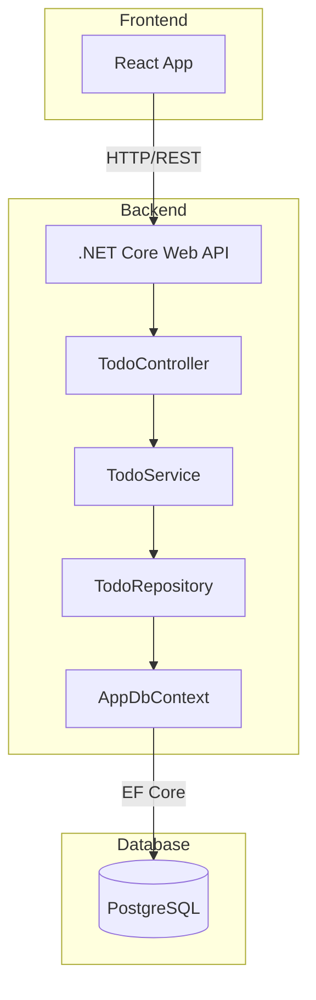

# Todo App Backend - .NET Core with PostgreSQL

## Overview

This backend provides a RESTful API for the Todo App frontend, built with .NET Core 8 and PostgreSQL database.

## Architecture



## Data Model

### Todo Entity

```csharp
public class Todo
{
    public int Id { get; set; }
    public string Text { get; set; } = string.Empty;
    public bool Completed { get; set; }
    public DateTime CreatedAt { get; set; }
    public DateTime? UpdatedAt { get; set; }
}
```

## API Endpoints

| Method | Endpoint              | Description                   |
| ------ | --------------------- | ----------------------------- |
| GET    | /api/todo             | Get all todos                 |
| GET    | /api/todo/{id}        | Get todo by ID                |
| POST   | /api/todo             | Create new todo               |
| PUT    | /api/todo/{id}        | Update todo                   |
| DELETE | /api/todo/{id}        | Delete todo                   |
| PATCH  | /api/todo/{id}/toggle | Toggle todo completion status |

## Project Structure

```
Backend/
├── Controllers/
│   └── TodoController.cs
├── Models/
│   └── Todo.cs
├── Data/
│   └── AppDbContext.cs
├── Services/
│   ├── ITodoService.cs
│   └── TodoService.cs
├── Repositories/
│   ├── ITodoRepository.cs
│   └── TodoRepository.cs
├── DTOs/
│   ├── CreateTodoDto.cs
│   ├── UpdateTodoDto.cs
│   └── TodoDto.cs
├── Program.cs
├── appsettings.json
├── appsettings.Development.json
└── TodoApi.csproj
```

## Implementation Steps

### 1. Create .NET Core Web API Project

```bash
cd Backend
dotnet new webapi -n TodoApi
cd TodoApi
```

### 2. Add Required Packages

```bash
dotnet add package Npgsql.EntityFrameworkCore.PostgreSQL
dotnet add package Microsoft.EntityFrameworkCore.Design
dotnet add package Microsoft.EntityFrameworkCore.Tools
```

### 3. Configure PostgreSQL Connection

Update `appsettings.json`:

```json
{
  "ConnectionStrings": {
    "DefaultConnection": "Host=localhost;Database=todo_db;Username=postgres;Password=your_password"
  }
}
```

### 4. Create Todo Model

```csharp
// Models/Todo.cs
namespace TodoApi.Models;

public class Todo
{
    public int Id { get; set; }
    public string Text { get; set; } = string.Empty;
    public bool Completed { get; set; }
    public DateTime CreatedAt { get; set; } = DateTime.UtcNow;
    public DateTime? UpdatedAt { get; set; }
}
```

### 5. Create DbContext

```csharp
// Data/AppDbContext.cs
using Microsoft.EntityFrameworkCore;
using TodoApi.Models;

namespace TodoApi.Data;

public class AppDbContext : DbContext
{
    public AppDbContext(DbContextOptions<AppDbContext> options) : base(options) { }

    public DbSet<Todo> Todos { get; set; }

    protected override void OnModelCreating(ModelBuilder modelBuilder)
    {
        modelBuilder.Entity<Todo>(entity =>
        {
            entity.HasKey(e => e.Id);
            entity.Property(e => e.Text).IsRequired().HasMaxLength(500);
            entity.Property(e => e.CreatedAt).HasDefaultValueSql("CURRENT_TIMESTAMP");
        });
    }
}
```

### 6. Create DTOs

```csharp
// DTOs/CreateTodoDto.cs
namespace TodoApi.DTOs;

public class CreateTodoDto
{
    public string Text { get; set; } = string.Empty;
}

// DTOs/UpdateTodoDto.cs
namespace TodoApi.DTOs;

public class UpdateTodoDto
{
    public string? Text { get; set; }
    public bool? Completed { get; set; }
}

// DTOs/TodoDto.cs
namespace TodoApi.DTOs;

public class TodoDto
{
    public int Id { get; set; }
    public string Text { get; set; } = string.Empty;
    public bool Completed { get; set; }
    public DateTime CreatedAt { get; set; }
    public DateTime? UpdatedAt { get; set; }
}
```

### 7. Create Repository

```csharp
// Repositories/ITodoRepository.cs
using TodoApi.Models;

namespace TodoApi.Repositories;

public interface ITodoRepository
{
    Task<IEnumerable<Todo>> GetAllAsync();
    Task<Todo?> GetByIdAsync(int id);
    Task<Todo> CreateAsync(Todo todo);
    Task<Todo> UpdateAsync(Todo todo);
    Task<bool> DeleteAsync(int id);
}

// Repositories/TodoRepository.cs
using Microsoft.EntityFrameworkCore;
using TodoApi.Data;
using TodoApi.Models;

namespace TodoApi.Repositories;

public class TodoRepository : ITodoRepository
{
    private readonly AppDbContext _context;

    public TodoRepository(AppDbContext context)
    {
        _context = context;
    }

    public async Task<IEnumerable<Todo>> GetAllAsync()
    {
        return await _context.Todos.OrderByDescending(t => t.CreatedAt).ToListAsync();
    }

    public async Task<Todo?> GetByIdAsync(int id)
    {
        return await _context.Todos.FindAsync(id);
    }

    public async Task<Todo> CreateAsync(Todo todo)
    {
        _context.Todos.Add(todo);
        await _context.SaveChangesAsync();
        return todo;
    }

    public async Task<Todo> UpdateAsync(Todo todo)
    {
        todo.UpdatedAt = DateTime.UtcNow;
        _context.Entry(todo).State = EntityState.Modified;
        await _context.SaveChangesAsync();
        return todo;
    }

    public async Task<bool> DeleteAsync(int id)
    {
        var todo = await _context.Todos.FindAsync(id);
        if (todo == null) return false;

        _context.Todos.Remove(todo);
        await _context.SaveChangesAsync();
        return true;
    }
}
```

### 8. Create Service

```csharp
// Services/ITodoService.cs
using TodoApi.DTOs;

namespace TodoApi.Services;

public interface ITodoService
{
    Task<IEnumerable<TodoDto>> GetAllTodosAsync();
    Task<TodoDto?> GetTodoByIdAsync(int id);
    Task<TodoDto> CreateTodoAsync(CreateTodoDto dto);
    Task<TodoDto?> UpdateTodoAsync(int id, UpdateTodoDto dto);
    Task<bool> DeleteTodoAsync(int id);
    Task<TodoDto?> ToggleTodoAsync(int id);
}

// Services/TodoService.cs
using TodoApi.DTOs;
using TodoApi.Models;
using TodoApi.Repositories;

namespace TodoApi.Services;

public class TodoService : ITodoService
{
    private readonly ITodoRepository _repository;

    public TodoService(ITodoRepository repository)
    {
        _repository = repository;
    }

    public async Task<IEnumerable<TodoDto>> GetAllTodosAsync()
    {
        var todos = await _repository.GetAllAsync();
        return todos.Select(MapToDto);
    }

    public async Task<TodoDto?> GetTodoByIdAsync(int id)
    {
        var todo = await _repository.GetByIdAsync(id);
        return todo == null ? null : MapToDto(todo);
    }

    public async Task<TodoDto> CreateTodoAsync(CreateTodoDto dto)
    {
        var todo = new Todo
        {
            Text = dto.Text,
            Completed = false,
            CreatedAt = DateTime.UtcNow
        };

        var created = await _repository.CreateAsync(todo);
        return MapToDto(created);
    }

    public async Task<TodoDto?> UpdateTodoAsync(int id, UpdateTodoDto dto)
    {
        var todo = await _repository.GetByIdAsync(id);
        if (todo == null) return null;

        if (dto.Text != null) todo.Text = dto.Text;
        if (dto.Completed.HasValue) todo.Completed = dto.Completed.Value;

        var updated = await _repository.UpdateAsync(todo);
        return MapToDto(updated);
    }

    public async Task<bool> DeleteTodoAsync(int id)
    {
        return await _repository.DeleteAsync(id);
    }

    public async Task<TodoDto?> ToggleTodoAsync(int id)
    {
        var todo = await _repository.GetByIdAsync(id);
        if (todo == null) return null;

        todo.Completed = !todo.Completed;
        var updated = await _repository.UpdateAsync(todo);
        return MapToDto(updated);
    }

    private static TodoDto MapToDto(Todo todo)
    {
        return new TodoDto
        {
            Id = todo.Id,
            Text = todo.Text,
            Completed = todo.Completed,
            CreatedAt = todo.CreatedAt,
            UpdatedAt = todo.UpdatedAt
        };
    }
}
```

### 9. Create Controller

```csharp
// Controllers/TodoController.cs
using Microsoft.AspNetCore.Mvc;
using TodoApi.DTOs;
using TodoApi.Services;

namespace TodoApi.Controllers;

[ApiController]
[Route("api/[controller]")]
public class TodoController : ControllerBase
{
    private readonly ITodoService _service;

    public TodoController(ITodoService service)
    {
        _service = service;
    }

    [HttpGet]
    public async Task<ActionResult<IEnumerable<TodoDto>>> GetAll()
    {
        var todos = await _service.GetAllTodosAsync();
        return Ok(todos);
    }

    [HttpGet("{id}")]
    public async Task<ActionResult<TodoDto>> GetById(int id)
    {
        var todo = await _service.GetTodoByIdAsync(id);
        if (todo == null) return NotFound();
        return Ok(todo);
    }

    [HttpPost]
    public async Task<ActionResult<TodoDto>> Create(CreateTodoDto dto)
    {
        if (string.IsNullOrWhiteSpace(dto.Text))
            return BadRequest("Text is required");

        var todo = await _service.CreateTodoAsync(dto);
        return CreatedAtAction(nameof(GetById), new { id = todo.Id }, todo);
    }

    [HttpPut("{id}")]
    public async Task<ActionResult<TodoDto>> Update(int id, UpdateTodoDto dto)
    {
        var todo = await _service.UpdateTodoAsync(id, dto);
        if (todo == null) return NotFound();
        return Ok(todo);
    }

    [HttpDelete("{id}")]
    public async Task<ActionResult> Delete(int id)
    {
        var result = await _service.DeleteTodoAsync(id);
        if (!result) return NotFound();
        return NoContent();
    }

    [HttpPatch("{id}/toggle")]
    public async Task<ActionResult<TodoDto>> Toggle(int id)
    {
        var todo = await _service.ToggleTodoAsync(id);
        if (todo == null) return NotFound();
        return Ok(todo);
    }
}
```

### 10. Configure Program.cs

```csharp
// Program.cs
using Microsoft.EntityFrameworkCore;
using TodoApi.Data;
using TodoApi.Repositories;
using TodoApi.Services;

var builder = WebApplication.CreateBuilder(args);

// Add services to the container
builder.Services.AddControllers();
builder.Services.AddEndpointsApiExplorer();
builder.Services.AddSwaggerGen();

// Configure PostgreSQL
builder.Services.AddDbContext<AppDbContext>(options =>
    options.UseNpgsql(builder.Configuration.GetConnectionString("DefaultConnection")));

// Register services
builder.Services.AddScoped<ITodoRepository, TodoRepository>();
builder.Services.AddScoped<ITodoService, TodoService>();

// Configure CORS
builder.Services.AddCors(options =>
{
    options.AddPolicy("AllowFrontend", policy =>
    {
        policy.WithOrigins("http://localhost:3000")
              .AllowAnyHeader()
              .AllowAnyMethod();
    });
});

var app = builder.Build();

// Configure the HTTP request pipeline
if (app.Environment.IsDevelopment())
{
    app.UseSwagger();
    app.UseSwaggerUI();
}

app.UseHttpsRedirection();
app.UseCors("AllowFrontend");
app.UseAuthorization();
app.MapControllers();

app.Run();
```

### 11. Create Migration

```bash
dotnet ef migrations add InitialCreate
dotnet ef database update
```

## Environment Setup

### Prerequisites

- .NET 8 SDK
- PostgreSQL installed and running
- Node.js (for frontend)

### Database Setup

1. Create PostgreSQL database:

```sql
CREATE DATABASE todo_db;
```

2. Update connection string in `appsettings.json`

3. Run migrations:

```bash
dotnet ef database update
```

### Running the Application

```bash
cd Backend/TodoApi
dotnet run
```

The API will be available at:

- HTTPS: https://localhost:7000
- HTTP: http://localhost:5000
- Swagger UI: https://localhost:7000/swagger

## Frontend Integration

Update the frontend to call the backend API instead of using local state. The API base URL should be configured to point to the backend server.

### Example API Calls

```javascript
// Get all todos
fetch("http://localhost:5000/api/todo")
  .then((res) => res.json())
  .then((data) => setTodos(data));

// Create todo
fetch("http://localhost:5000/api/todo", {
  method: "POST",
  headers: { "Content-Type": "application/json" },
  body: JSON.stringify({ text: "New todo" }),
});

// Toggle todo
fetch(`http://localhost:5000/api/todo/${id}/toggle`, {
  method: "PATCH",
});

// Delete todo
fetch(`http://localhost:5000/api/todo/${id}`, {
  method: "DELETE",
});
```

## Testing

### Using curl

```bash
# Get all todos
curl https://localhost:7000/api/todo

# Create todo
curl -X POST https://localhost:7000/api/todo \
  -H "Content-Type: application/json" \
  -d '{"text": "Test todo"}'

# Toggle todo
curl -X PATCH https://localhost:7000/api/todo/1/toggle

# Delete todo
curl -X DELETE https://localhost:7000/api/todo/1
```

## Error Handling

The API returns standard HTTP status codes:

- 200: Success
- 201: Created
- 204: No Content (successful delete)
- 400: Bad Request
- 404: Not Found
- 500: Internal Server Error

## Security Considerations

1. **CORS**: Configured to allow only the frontend origin
2. **Input Validation**: DTOs validate required fields
3. **SQL Injection**: Protected by Entity Framework parameterized queries
4. **HTTPS**: Enforced in production

## Performance

1. **Async/Await**: All database operations are asynchronous
2. **Indexing**: Primary key indexed by default
3. **Pagination**: Can be added for large datasets
4. **Caching**: Can be implemented for frequently accessed data
